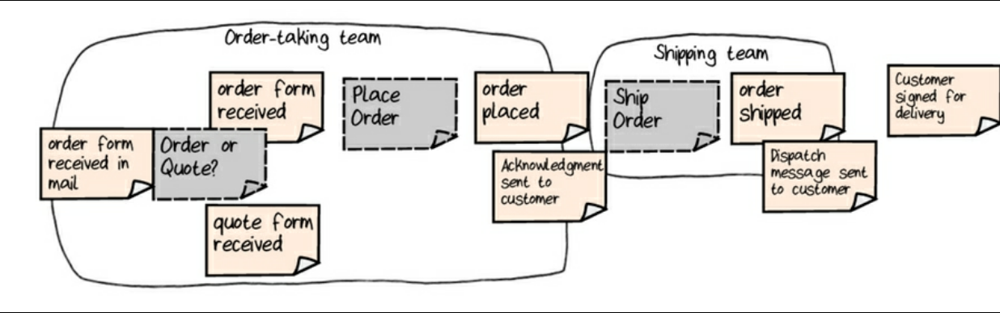
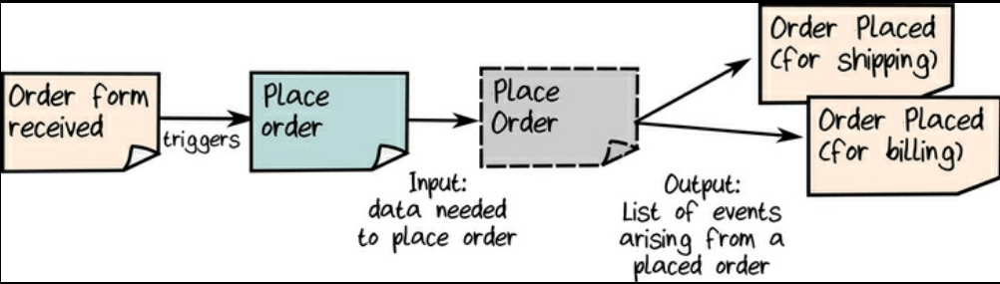

# 2025-11-24

## Starting!

I created a new springboot project with Copilot to host the examples in case of I need to use some REST API in the future examples of
code.

The purpose of these entries is to log and summarize the practical content that I will 
code while I re-read the book again to gain more practical knowledge about DDD with functional programming perspective.

## Book Chapter 1: Introducing Domain-Driven Design

In this chapter the author introduces the business problem to be solved through the chapters of the book: **An
Order-Taking System**

The author demonstrates how to discover the domain and the result is the following after Event Storming session:

And he makes a zoom in the "order-taking" business process:

The next day I will continue with the next chapter to extract the relevant practical information.

## Notes That I Took While Reading The Chapter

> [Notes from my digital brain](https://marius9595.github.io/cerebro-digital-con-quartz/Bibliograf%C3%ADa/Libros/Domain-Modeling-Made-Functional#1-introducing-domain-driving-design)