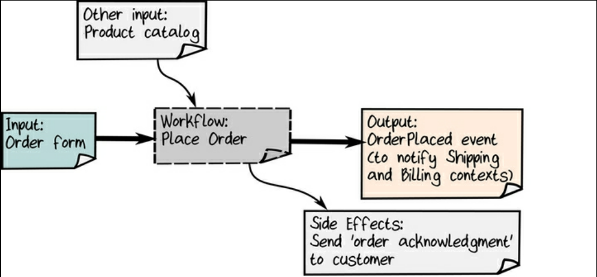
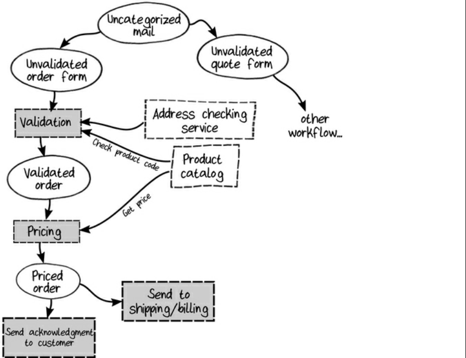

# 2025-11-27

## Book Chapter 2: Understanding the Domain

In this chapter the author take one workflow to deep dive into it. The approach used is to discover the commands and
events related to the workflow.
The methodology used here is a series of short interviews to domain experts focusing at high level only on the inputs
and outputs of the workflow, avoiding getting swamped with details that areno relevant to the design yet.

From the interviews the author extract the following visual or resume about workflow with commands and events (and side effects):



The author proposes to use a semiformal notation to document the workflow, the result applied to the order-taking is the following:

```plaintext
Bounded context: Order-Taking
    Workflow: "Place order" 
        triggered by:  "Order form received" event (when Quote is not checked) 
        primary input: An order form 
        other input: Product catalog 
        output events: "Order Placed" event  
        side-effects:  An acknowledgment is sent to the customer, along with the placed order

Data structures

data Order = CustomerInfo
  AND ShippingAddress
  AND BillingAddress 
  AND list of OrderLines 
  AND AmountToBill

data OrderLine =  Product
    AND Quantity 
    AND Price
    
data CustomerInfo = ???   // don't know yet

data BillingAddress = ??? // don't know yet

```


However, once the author deeps into the details of the workflow, he discovers rules and validations, and he puts them in the following
diagram:



Although the diagram is useful to understand the workflow, the authot points to write semiformal description of the rules and validations discovered:

```plaintext
context: Order-Taking
 
data WidgetCode = string starting with "W" then 4 digits 

data GizmoCode = string starting with "G" then 3 digits

data ProductCode = WidgetCode OR GizmoCode

data OrderQuantity = UnitQuantity OR KilogramQuantity

data UnitQuantity = integer between 1 and 1000

data KilogramQuantity = decimal between 0.05 and 100.00

```

Then the author reflexes about the life cycle of the Order entity, distinguishing between unvalidated, validated,  priced and acknowledgment. orders, he 
pushes to modeling it like this separately:

```plaintext

data UnvalidatedOrder = UnvalidatedCustomerInfo 
    AND UnvalidatedShippingAddress 
    AND UnvalidatedBillingAddress 
    AND list of UnvalidatedOrderLine

data UnvalidatedOrderLine = UnvalidatedProductCode 
    AND UnvalidatedOrderQuantity
----

data ValidatedOrder = ValidatedCustomerInfo 
    AND ValidatedShippingAddress
    AND ValidatedBillingAddress 
    AND list of ValidatedOrderLine

data ValidatedOrderLine = ValidatedProductCode 
    AND ValidatedOrderQuantity

-----

data PricedOrder = ValidatedCustomerInfo
    AND ValidatedShippingAddress
    AND ValidatedBillingAddress
    AND list of PricedOrderLine  // different from ValidatedOrderLine
    AND AmountToBill             // new

data PricedOrderLine = ValidatedOrderLine 
    AND LinePrice                // new

-----

data PlacedOrderAcknowledgment = PricedOrder 
    AND AcknowledgmentLetter

```

why author models like this? Because this reflects the domain or how business works accurately.


## Recap

The union of all info discovered in this chapter can be summarized in the following pseudocode of the order-taking workflow:

```plaintext

workflow "Place Order" = 
    input: OrderForm
    output: OrderPlaced event (put on a pile to send to other teams)
        OR InvalidOrder (put on appropriate pile)
        
     // step 1 
     do ValidateOrder 
     If order is invalid then: 
        add InvalidOrder to pile
        stop
     
     // step 2 
     do PriceOrder
     
     // step 3 
     do SendAcknowledgmentToCustomer 
     
     // step 4 return OrderPlaced event (if no errors)
```

Deeper dive into each step:

```plaintext

substep "ValidateOrder" = 
    input: UnvalidatedOrder 
    output: ValidatedOrder 
        OR ValidationError
    dependencies: CheckProductCodeExists, CheckAddressExists    
     
    validate the customer name 
    check that the shipping and billing address exist
    
    for each line: 
        check product code syntax 
        check that product code exists in ProductCatalog
            if everything is OK, then: 
                return ValidatedOrder 
            else:
                return ValidationError

substep "PriceOrder" =
    input: ValidatedOrder 
    output: PricedOrder
    dependencies: GetProductPrice
      
    for each line:
        get the price for the product 
        set the price for the line
         set the amount to bill ( = sum of the line prices)


substep "SendAcknowledgmentToCustomer" = 
    input: PricedOrder
    output: None
    
    create acknowledgment letter and send it and the priced order to the customer

```

This result is near to the implementation, but still readble for a domain expert.
